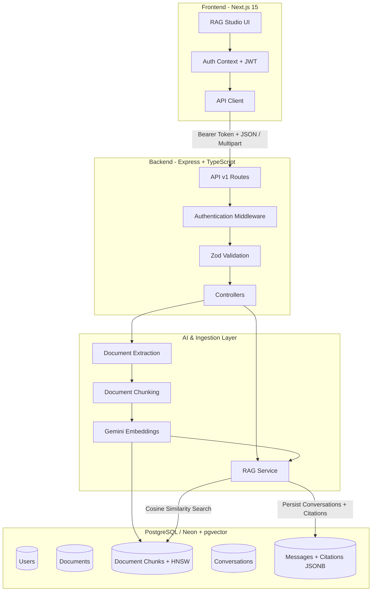

<div align="center">

# 🧠 VectorMind-AI

### Production-Grade Full-Stack Retrieval-Augmented Generation (RAG) Platform

<p>
  
  
  
  
  
  
  
  
  
</p>

<p>
  A full-stack AI knowledge platform for document ingestion, semantic search,
  grounded RAG conversations, persistent citations, and multi-turn conversational memory.
</p>

</div>

---

## 📖 Overview

**VectorMind-AI** is a production-oriented full-stack Retrieval-Augmented Generation (RAG) platform that allows users to upload documents, search them using semantic similarity, and interact with an AI assistant whose responses are grounded in the uploaded content.

The application uses a decoupled architecture with a **Next.js frontend** and a standalone **Node.js + Express backend**. Documents are processed into chunks, converted into vector embeddings, and stored in **PostgreSQL with pgvector** for efficient similarity search.

AI-generated responses are powered by **Google Gemini**, while retrieved document metadata is persisted alongside conversations to provide traceable citations.

---

## ✨ Key Features

### 📄 Document Intelligence

* Upload `.pdf` and `.txt` documents
* Automatic text extraction
* Semantic paragraph-based chunking
* Fixed-size chunking support
* Asynchronous background ingestion pipeline via **Inngest**
* Live polling and real-time document status tracking (`PENDING` -> `PROCESSING` -> `COMPLETED`)
* Page number and chunk index tracking
* Transactional document processing
* Idempotent ingestion workflow

### 🔎 Semantic Search

* Vector-based document retrieval
* Google embedding models
* PostgreSQL `pgvector`
* HNSW approximate nearest-neighbor indexing
* Cosine similarity search
* User-scoped vector queries

### 🤖 Retrieval-Augmented Generation

* Real-time Server-Sent Events (SSE) token streaming
* Grounded AI responses using retrieved document context
* Google Gemini 2.5 Flash
* Multi-document question answering
* Citation-aware responses
* Persistent citation metadata
* Multi-turn conversational context

### 🔐 Authentication & Security

* **Auth.js / NextAuth** and JWT Bearer token authentication
* Password hashing using `bcryptjs`
* Protected API routes
* Optional authentication for scoped resources
* Zod runtime request validation
* Standardized HTTP error handling
* Multi-tenant data isolation

### 💬 Conversational Memory

* Persistent conversations
* Multi-turn chat history
* Follow-up question support
* Recent conversation context injection
* Persistent message and citation storage

### ⚡ Background Processing

* Inngest-based event processing
* Document extraction
* Chunk generation
* Embedding generation
* Retry handling
* Local development fallback

---

# 🏗️ Architecture

VectorMind follows a decoupled full-stack architecture:



---

# 🛠️ Tech Stack

| Category          | Technology              | Purpose                                     |
| ----------------- | ----------------------- | ------------------------------------------- |
| Frontend          | Next.js 15              | Full-stack React application and App Router |
| UI                | React 19                | Interactive user interface                  |
| Styling           | Tailwind CSS            | Responsive styling                          |
| UI Components     | Radix UI, Lucide        | Accessible interface components             |
| Backend           | Node.js 20+             | Server-side runtime                         |
| API               | Express.js 4            | REST API                                    |
| Language          | TypeScript 5.7          | Type-safe development                       |
| Database          | PostgreSQL 16           | Relational data storage                     |
| Database Hosting  | Neon                    | Serverless PostgreSQL                       |
| ORM               | Prisma 5.22             | Database access and migrations              |
| Vector Search     | pgvector                | Vector similarity search                    |
| Vector Index      | HNSW                    | Approximate nearest-neighbor retrieval      |
| AI                | Google Gemini 2.5 Flash | RAG response generation                     |
| Embeddings        | Google Embeddings       | Document vectorization                      |
| Validation        | Zod                     | Runtime request validation                  |
| Authentication    | JWT                     | Stateless authentication                    |
| Password Security | bcryptjs                | Password hashing                            |
| Background Jobs   | Inngest                 | Asynchronous processing                     |

---

# 📂 Project Structure

```text
VectorMind-AI/
│
├── backend/
│   ├── prisma/
│   │   ├── migrations/
│   │   └── schema.prisma
│   │
│   ├── src/
│   │   ├── config/
│   │   ├── controllers/
│   │   ├── db/
│   │   ├── middleware/
│   │   ├── routes/
│   │   ├── schemas/
│   │   ├── scripts/
│   │   ├── services/
│   │   ├── app.ts
│   │   └── server.ts
│   │
│   └── package.json
│
├── src/
│   ├── app/
│   │   ├── (chat)/
│   │   │   └── chat/
│   │   │       └── page.tsx
│   │   ├── api/
│   │   ├── layout.tsx
│   │   └── page.tsx
│   │
│   ├── components/
│   │   ├── auth-modal.tsx
│   │   ├── navbar.tsx
│   │   ├── tabs/
│   │   └── ui/
│   │
│   └── lib/
│       ├── api/
│       │   └── client.ts
│       └── auth/
│           └── auth-context.tsx
│
├── package.json
├── pnpm-lock.yaml
└── README.md
```

---

# 🚀 Getting Started

## Prerequisites

Before running VectorMind locally, make sure you have:

* **Node.js** `20.x` or higher
* **pnpm** `9.x`
* A **Neon PostgreSQL** database
* PostgreSQL `pgvector` extension enabled
* A **Google Gemini API key**

Install pnpm if necessary:

```bash
npm install -g pnpm
```

---

## 1. Clone the Repository

```bash
git clone https://github.com/Sagenmurmu/VectorMind-AI.git

cd VectorMind-AI
```

---

## 2. Install Dependencies

Install all workspace dependencies:

```bash
pnpm install
```

---

# 🔐 Environment Variables

VectorMind requires environment variables for the frontend, backend, database, authentication, and Google Gemini.

## Root `.env`

Create a `.env` file in the project root:

```env
# Frontend
NEXT_PUBLIC_API_URL="http://localhost:5000/api/v1"

# Database
DATABASE_URL="your-neon-pooled-connection-string"
DIRECT_URL="your-neon-direct-connection-string"

# Google Gemini
GEMINI_API_KEY="your-gemini-api-key"
GOOGLE_GENERATIVE_AI_API_KEY="your-gemini-api-key"
```

## Backend `.env`

Create:

```text
backend/.env
```

Add:

```env
# Server
PORT=5000
NODE_ENV=development
FRONTEND_URL=http://localhost:3000

# Authentication
JWT_SECRET="your-super-secret-jwt-key"
JWT_EXPIRES_IN="7d"

# Google Gemini
GEMINI_API_KEY="your-gemini-api-key"
GOOGLE_GENERATIVE_AI_API_KEY="your-gemini-api-key"

# Database
DATABASE_URL="your-neon-pooled-connection-string"
DIRECT_URL="your-neon-direct-connection-string"
```

> ⚠️ Never commit `.env` files or API keys to GitHub.

Make sure `.gitignore` contains:

```gitignore
.env
.env.local
.env.*.local
backend/.env
```

---

# 🗄️ Database Setup

VectorMind uses PostgreSQL with the `pgvector` extension.

After configuring your Neon database, run:

```bash
pnpm prisma migrate deploy
```

Then generate the Prisma client:

```bash
pnpm prisma generate
```

The database stores:

* Users
* Documents
* Document chunks
* Vector embeddings
* Conversations
* Messages
* Citation metadata

---

# ▶️ Running the Application

VectorMind uses separate frontend and backend development servers.

### Terminal 1 — Backend

```bash
pnpm dev:backend
```

Backend:

```text
http://localhost:5000
```

### Terminal 2 — Frontend

```bash
pnpm dev
```

Frontend:

```text
http://localhost:3000
```

Open:

```text
http://localhost:3000
```

---

# 📡 API Reference

Base URL:

```text
http://localhost:5000/api/v1
```

## Authentication

| Method | Endpoint         | Description                     | Authentication |
| ------ | ---------------- | ------------------------------- | -------------- |
| POST   | `/auth/register` | Register a new user             | No             |
| POST   | `/auth/login`    | Authenticate user and issue JWT | No             |
| GET    | `/auth/me`       | Get authenticated user profile  | Bearer Token   |

---

## Documents

| Method | Endpoint            | Description                                  | Authentication |
| ------ | ------------------- | -------------------------------------------- | -------------- |
| POST   | `/documents/upload` | Upload and process `.txt` / `.pdf` documents | Optional       |
| GET    | `/documents`        | List user's documents                        | Optional       |
| GET    | `/documents/:id`    | Get document details and chunk statistics    | Optional       |
| DELETE | `/documents/:id`    | Delete document and associated chunks        | Optional       |

---

## Semantic Search

| Method | Endpoint  | Description                      | Authentication |
| ------ | --------- | -------------------------------- | -------------- |
| POST   | `/search` | Perform vector similarity search | Optional       |

---

## RAG & Conversations

| Method | Endpoint             | Description                    | Authentication |
| ------ | -------------------- | ------------------------------ | -------------- |
| POST   | `/chat`              | Generate grounded RAG response | Optional       |
| GET    | `/conversations`     | List conversation threads      | Bearer Token   |
| POST   | `/conversations`     | Create conversation thread     | Bearer Token   |
| GET    | `/conversations/:id` | Retrieve conversation messages | Bearer Token   |
| PATCH  | `/conversations/:id` | Update conversation title      | Bearer Token   |
| DELETE | `/conversations/:id` | Delete conversation            | Bearer Token   |

---

# 🧪 Testing & Verification

VectorMind contains automated verification suites for database operations, document ingestion, RAG functionality, and multi-tenant security.

## Database & pgvector

```bash
pnpm test:db
```

Verifies database connectivity and vector functionality.

## Document & RAG Pipeline

```bash
pnpm test:phase3
```

Verifies:

* Document ingestion
* Text extraction
* Chunking
* Embedding generation
* RAG pipeline

## Multi-Tenant Security

```bash
pnpm test:phase4
```

Verifies:

1. User registration
2. Password hashing
3. JWT authentication
4. Document upload
5. Document isolation
6. Authorization guards
7. RAG response generation
8. Citation persistence
9. Multi-turn conversation recall
10. User-scoped vector search

---

# 🔒 Security & Data Isolation

VectorMind is designed with multi-tenant isolation in mind.

Each authenticated user's documents and vector searches are scoped to their user identity.

Security mechanisms include:

* JWT authentication
* Password hashing with `bcryptjs`
* Zod request validation
* Protected API routes
* User-scoped database queries
* User-scoped vector similarity searches
* Authorization checks for document operations
* Persistent citation metadata

This prevents users from accessing documents or vector chunks belonging to other users.

---

# ⚡ Available Scripts

| Command                      | Description                               |
| ---------------------------- | ----------------------------------------- |
| `pnpm dev`                   | Start Next.js development server          |
| `pnpm dev:backend`           | Start Express backend in development mode |
| `pnpm build`                 | Build the frontend                        |
| `pnpm build:backend`         | Compile backend TypeScript                |
| `pnpm test:db`               | Run database and pgvector verification    |
| `pnpm test:phase3`           | Run ingestion and RAG verification        |
| `pnpm test:phase4`           | Run multi-tenant security tests           |
| `pnpm prisma migrate deploy` | Apply Prisma migrations                   |
| `pnpm prisma generate`       | Generate Prisma client                    |

---

# 🔄 RAG Pipeline

The core VectorMind workflow can be summarized as:

```text
Document Upload
      │
      ▼
Text Extraction
      │
      ▼
Document Chunking
      │
      ▼
Embedding Generation
      │
      ▼
PostgreSQL + pgvector
      │
      ▼
User Query
      │
      ▼
Query Embedding
      │
      ▼
Cosine Similarity Search
      │
      ▼
Relevant Document Chunks
      │
      ▼
Gemini 2.5 Flash
      │
      ▼
Grounded Response + Citations
      │
      ▼
Persistent Conversation
```

---

# 📌 Core Engineering Highlights

VectorMind demonstrates practical implementation of:

* Full-stack TypeScript development
* REST API architecture
* Next.js App Router
* Express.js backend architecture
* PostgreSQL database design
* Prisma ORM
* Vector databases and similarity search
* `pgvector` HNSW indexing
* Retrieval-Augmented Generation
* AI embeddings
* LLM integration
* Document processing pipelines
* JWT authentication
* Multi-tenant authorization
* Background job processing
* Automated integration testing

---

# 📄 License

This project is licensed under the **MIT License**.

---

<div align="center">

### 🧠 VectorMind-AI

**Full-Stack • AI • RAG • Vector Search • PostgreSQL**

</div>
